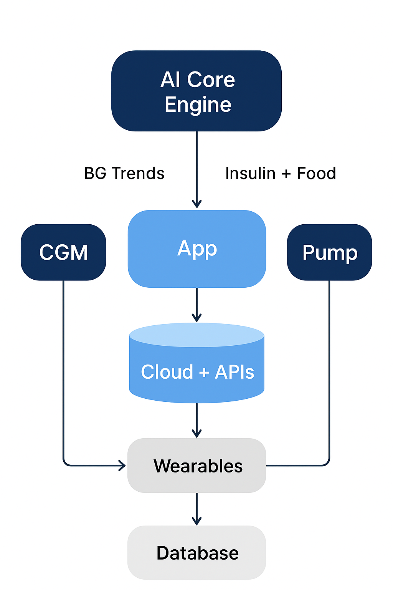

# 💙 GluVerse – The Smart Diabetes Companion

**GluVerse** is an AI-powered diabetes management platform that unites your **CGM, pump, meals, and lifestyle** into one intelligent ecosystem.  
Built for people with **Type 1 Diabetes (T1D)** — GluVerse predicts, personalizes, and simplifies daily glucose control with empathy and precision.

---

## 🧠 Why GluVerse?
> “GluVerse isn’t just another diabetes tracker — it’s your **daily co-pilot**, helping you predict, prevent, and personalize every moment of care.”

---

## 🏗️ System Architecture

_Illustration: High-level data flow between AI, CGM, Pump, and Cloud Services._

**Key Components:**
- **AI Core Engine:** Predictive analytics for insulin, carbs, and BG trends.  
- **Data Sync Layer:** Secure integration with CGMs, pumps, and wearables.  
- **App Layer:** Offline-first mobile app for real-time insights and nudges.  
- **Cloud + API:** Secure sync, analytics, and doctor dashboards.

---

## 📱 User Flow Overview

_User Journey: From meal capture → AI prediction → insulin recommendation → reflection feedback._

---

## 🚀 Core Features

### 🍽️ Food Photo Analysis
- AI identifies **ingredients, portion sizes, and cooking methods**.  
- Integrates **USDA/Nutritionix APIs** for accurate macro estimates.  
- Flags **high-GI foods** and hidden sugars for insulin adjustments.  
- Predicts **glycemic load** and **absorption delays** (e.g., fat-driven 2hr BG peaks).  
- Supports **manual macro tweaks** for fine-tuning.

---

### 📈 Universal CGM Integration
- Real-time sync with **Dexcom**, **Libre**, **Medtronic**, and **Eversense** via BLE/cloud APIs.  
- Displays glucose readings, **trend arrows**, and **1–4hr histories**.  
- Syncs with **Apple Health** and wearables (activity, sleep, HRV).  
- **Modular SDK** for new CGMs and manual BG entry if offline.

---

### ⚙️ Manual Pump Settings
- Input and simulate **basal rates, ISF, and carb ratios**.  
  Example: `Basal: 0.8U/hr`, `ISF: 1U per 50mg/dL`, `ICR: 1U per 10g carbs`.  
- Supports **Omnipod, Medtronic, Tandem, iLet**, and **smart pens**.  
- Tracks **IOB** and **bolus behavior** without direct pump control.  
- Extend bolus? Get **reminders every 30 minutes**.

---

### 📊 BG Trend Analysis
- Graphs **post-meal BG curves** vs. target (80–140 mg/dL).  
- Attributes spikes/crashes to **macros or IOB**.  
- ML-driven **"what-if" simulations** for basal/bolus tuning.  
- Predicts **hypo/hyper risks** using time-series models.

---

### 💡 Personalized Recommendations
- Adaptive **bolus tweaks, food swaps, and lifestyle nudges**.  
- Learns from activity, sleep, and historical glucose patterns.

---

### 🍛 Repeat-Meal Memory
- Stores meal “fingerprints” with BG response history.  
- Auto-suggests insulin doses for similar future meals.  
- Adapts to **seasons, stress, and time of day**.

---

### 🧠 Friend-Like Interaction
- Empathetic **chatbot + voice assistant** for motivation and alerts.  
- Gamified with **badges, streaks, and community sharing**.

---

### 🔮 Predictive Tools
- **Weekly A1C forecasts**, disruption-aware predictions, and emotional eating detection.  
- Long-term risk modeling for **lifestyle optimization**.

---

### 🛡️ Safety & Compliance
- **Critical BG alerts** with auto-exportable logs.  
- **Ethical ML**, **HIPAA/GDPR compliance**, and **AES-256 encryption**.  
- **User confirmation safeguards** for all sensitive actions.

---

### 🌍 Lifestyle Integrations
- Connects with grocery apps, wearables, and **AR meal previews**.  
- **Community-driven recipes** and user-rated meal plans.

---

### 💸 Monetization & Scalability
| Tier | Description | Monthly Cost |
|------|--------------|--------------|
| **Free** | Core tracking, CGM sync, food logging | $0 |
| **Pro** | AI predictions, Endo dashboard, family sharing | **$4.99** |
| **Partner API** | Developer integrations and research access | Custom |

---

## ⚙️ Enhanced Features

### 🔁 Smart Learning Loop
- Users “rate” AI suggestions (`Worked great 👍 / Spike ⚠️`).  
- GluVerse self-tunes predictions based on personal feedback.

---

### 📶 Offline-First Architecture
- Runs even without Wi-Fi or CGM sync.  
- Uses **local SQLite + delayed sync** for reliability on the go.

---

### 🩺 Endocrinologist Dashboard (Pro)
- One-tap doctor summary exports (not raw data).  
- Example: _“Meals with >50mg/dL post-meal rise = 42% this week.”_

---

### 👨‍👩‍👧 Family / Caregiver Mode
- For parents or partners monitoring remotely.  
- **Safety sharing:** if BG <60mg/dL for 15+ mins → auto-send live location (opt-in).

---

### 🥗 AI Nutrition Coach
- Conversational meal swap suggestions.  
  Example: _“Replace 100g chutney with 50g + curd for same taste, half the spike.”_  
- Gamifies healthy eating and rewards **steady glucose curves**.

---

## 🧩 Tech Stack (Conceptual)

| Layer | Technology | Purpose |
|-------|-------------|----------|
| **Frontend** | React Native | Cross-platform, offline-first app |
| **Backend** | FastAPI + PostgreSQL + Redis | Real-time API & analytics |
| **AI/ML** | PyTorch, Prophet, LSTM | Predictive BG modeling |
| **Cloud Infra** | AWS (S3, Lambda, API Gateway) | Secure, scalable |
| **Security** | OAuth2 + AES-256 + HIPAA compliance | Data protection |
| **Local Storage** | SQLite | Offline mode with sync queue |

---

## 🧭 Roadmap

- [ ] Beta Launch with Dexcom & Omnipod users  
- [ ] Release AI Nutrition Coach  
- [ ] Enable Family/Caregiver Mode  
- [ ] Smart Learning Feedback Loop  
- [ ] Open Developer API SDK  

---

## 🤝 Contributing

We welcome contributions from developers, clinicians, and T1D advocates!  
Please read our [CONTRIBUTING.md](./CONTRIBUTING.md) for setup and PR guidelines.

---

## 📜 License

Licensed under the [MIT License](./LICENSE).

---

## 💬 Contact

**Project Lead:** Satwik Gardas  
📧 [contact@gluverse.ai](mailto:contact@gluverse.ai)  
🌐 [www.gluverse.ai](https://www.gluverse.ai) _(Coming Soon)_

---

**GluVerse – Smarter. Kinder. Safer Diabetes Care. 💙**
